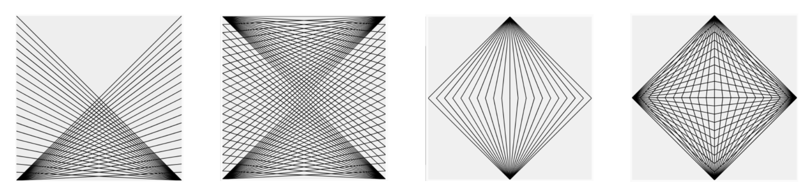
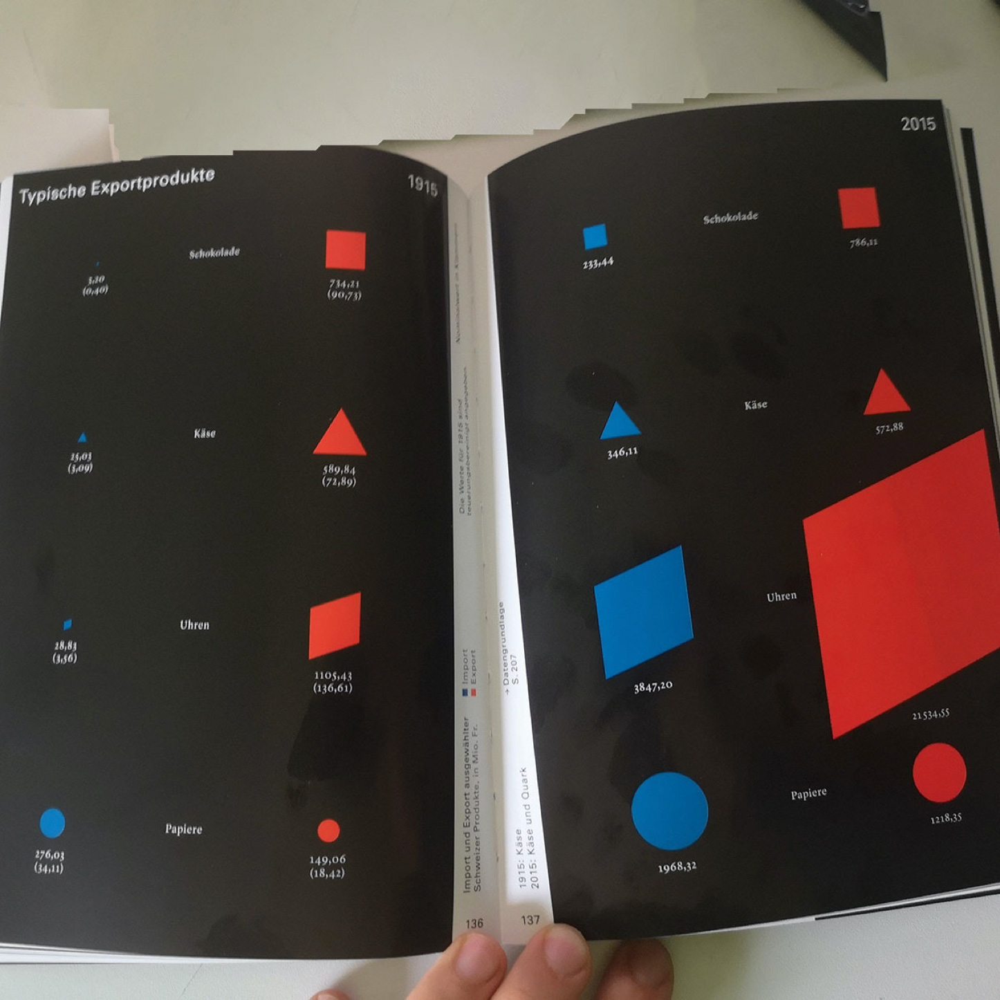
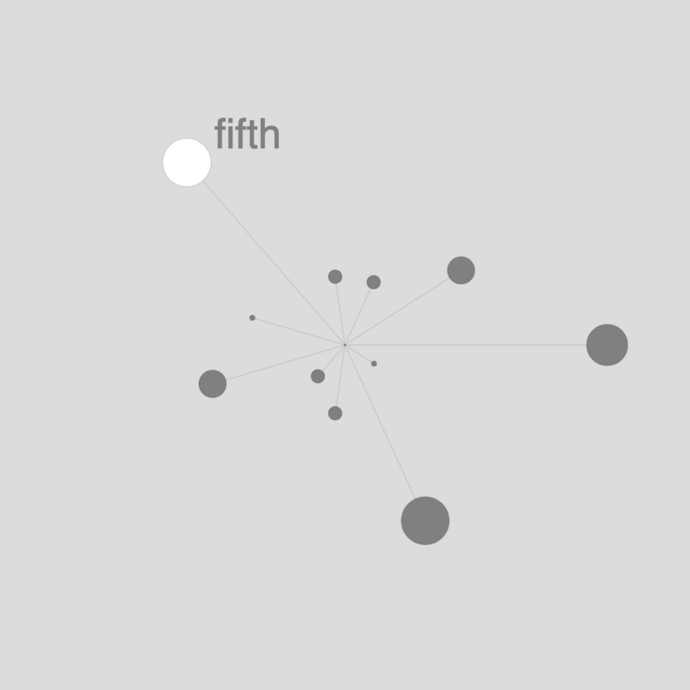

# HS23 Play 1: Creative Coding

Repository für den «Creative Coding» Kurs im Modul Play 1 mit Gordan Savičić & Max Frischknecht, 6.-8. November 2023, HSLU Data Design + Art

Im Kurs «Creative Coding» schreibt ihr eure ersten kleinen Programme um einen visuellen Output zu generieren. Ihr nutzt dazu P5js, eine Javascript-Library für Creative Coding, mit dem Schwerpunkt, das Programmieren für Künstler, Designer, Pädagogen, Anfänger und alle anderen zugänglich zu machen. Für mehr Info's zu P5js, schau dir die [Webseite](https://p5js.org/) an.

## Übersicht

**Montag**

- Vormittag: Einführung, Übung 1 «Selbstportrait» (Gordan)
- Nachmittag: Übung 2 «10Print» (Max)

**Dienstag**

- Vormittag: Übung 3 & 4, mit Arrays arbeiten, CSV Daten importieren (Gordan)
- Nachmittag: Projektarbeit & individuelle Betreuung (Max)

**Mittwoch**

- Vormittag: Projektarbeit & individuelle Betreuung (Max)
- Nachmittag: Kurzes Show & Tell, Projektarbeit, Dokumentation & individuelle Betreuung (Gordan & Max)

## Day 1, Montag

### Vormittag: Kick Off & Übung 1 «Selbstportrait»

- Um gleich loslegen zu können nutzen wir den von P5 zur Verfügung gestellten Online-Editor. Erstelle dazu [hier](https://editor.p5js.org/) einen Account.
- Schreibe deine erste Zeile Code: Ergänze `line(0,0,100,100);` in Zeile 7 vor dem `}`
- Was beschreiben die vier Parameter von `line` innherhalb der Klammern? Seht euch dazu auch die [Online-Referenz](https://p5js.org/reference/#/p5/line) an. Eine solche Referenz existiert für jede Funktion die P5 bietet.
- Kannst du den Code ergänzen, damit ein X angezeigt wird?
- Könnt ihr einen Kreis in die Mitte der Zeichenfläche setzen? Färbt den Kreis in einer anderen Farbe ein.


Zeichnet euch selbst in P5js! Don’t go for realistic, konzentriert euch auf ein markantes Detail. Alles ist erlaubt. Dadurch lernt ihr die folgenden grundlegenden Techniken von P5:

- Umgang mit dem Koordinaten System
- Grundstruktur eines Programmes mit `setup` und `draw`
- Zeichnen mit Formen (`rect`, `ellipse`, u.a.)
- Umgang mit Farben und Konturen (`fill`, `stroke`, `strokeWeight`, `noFill`, `noStroke`)
- Verwenden von Variablen für Zahlen- und Farbwerte (`let x = 10;`)
- Verwenden von Kommentaren mit `// dein Kommentar`

Geht alles etwas schnell? Wir können euch die Youtube-Tutorials von Dan Shiffmann ans Herz legen. [Hier](https://www.youtube.com/watch?v=c3TeLi6Ns1E&list=PLRqwX-V7Uu6Zy51Q-x9tMWIv9cueOFTFA&t=0s) gibts eines zu Formen, Farben und Zeichnen in P5.

#### Variablen

Variablen sind ein zentraler Bestandteil jeder Programmiersprache. Mittels einer Variable kann man den Wert einmal festlegen um in dann an verschiedenen Orten im Programm zu verwenden. Dadurch wird es einfacher diesen Wert nachträglich zu verändern. Hier ein Beispiel wie man eine Variable definiert.

```js
let meineVariable; // definiere eine "leere" Variable mit dem namen "meineVariable" (bis auf ein paar Ausnahmen frei wählbar)
meineVariable = 10; // den Wert 10 der Variable zuweisen

let neueVariable = 20; // Variable definieren und direkt einen Wert zuweisen
```

Hier ist ein einfaches Beispiel wie eine Variable verwendet werden kann um ein Rechteck an Position `10`, `10` mit einer Breite und Höhe von `100` Pixel zu zeichnen.

```js
let size = 100;
let x = 10;
let y = 10;

rect(x, y size, size)
```

#### Operatoren

Handelt es sich bei der gespeicherten Variable um eine Zahl kann man einfache mathematische Operationen vornehmen mit `+`, `-`, `*` und `/`. Hier ist ein Beispiel:

```js
let size = 100; // initialer Wert
size = size + 100; // nun ist size 200
size = size - 50; // nun ist size 150
size = size * 2; // nun ist size 300
size = size / 2; // nun ist size wieder 150
```

Sketch: [Bewegte Ellipse](https://editor.p5js.org/ritzdank/sketches/auAN2lb8a)

#### Vorgegebene Variablen

Es gibt einige Variablen welche P5 euch automatisch zur Verfügung stellt:

- `mouseX` und `mouseY` beinhalten die Position eurer Maus. Versuche einmal eine Form zu zeichnen und ersetze `x` und `y` durch diese Variablen, cool oder?
- `width` und `height` beinhalten die Dimensionen eures Sketches, also die Zahlen welche ihr im Befehl `createCanvas()` festlegt. Diese Variablen sind sehr nützlich um bspw. mit einem Grid zu arbeiten oder Objekte bspw. in der Mitte zu positionieren.
- Für weitere Info's zu Variablen sieh dir [dieses Dokument](<(https://github.com/fleshgordo/LaboCreativeCoding/blob/main/02_variables.md)>) sowie [dieses Video](https://tube.switch.ch/videos/8c793d97) von Gordan an.

#### Random

Normalerweise braucht man ein bisschen Zufall, damit die Resultate eurer Programme 🔥 werden. Dafür gibt es u.a. den Befehl `random()` welcher euch eine zufällige Zahl innerhalb eines von euch festgelegten Rahmens erzeugt.

```js
// zufällige Zahl zwischen 1 und 100
let xRan = random(0, 100);

// zufällige Zahl zwischen 1 und der Höhe eures Sketches
let yRan = random(0, height);
```

#### If/else Statements

If/else Statements kommen in den meisten Programmiersprachen vor und sind ein zentrales Konzept. Im Kern geht es darum einen Teil des Codes nur auszuführen wenn eine Bedingung erfüllt ist, und, je nach dem ob Gewünscht, wenn die Bedingung nicht erfüllt ist, anderen Code ausführen.

```js
let maximum = 100;

if (maximum == 100) {
  // wenn maximum 100 ist, wird dieser code ausgefüht
  ellipse(10, 10, 20, 20);
} else {
  // falls nicht, dieser hier
  rect(10, 10, 20, 20);
}
```

Ihr könnt auch Werte vergleich ob sie z. B. grösser oder kleiner sind:

```js
if (mouseX < width / 2) {
  background(0);
} else {
  background(255);
}
```

Coding Train erklärt es in diesem [Video](https://www.youtube.com/watch?v=1Osb_iGDdjk) im Detail.

### Nachmittag, Übung 2 «10Print»


10 Print ist ein bekanntes [Buch](https://10print.org/) in der Creative Coding Community welches die Möglichkeiten einer einzelnen [Zeile Code](https://www.youtube.com/watch?v=m9joBLOZVEo) aus künstlerischer Perspektive zeigt. Eure Aufgabe ist es nun, eine neue Version des Klassikers “10 PRINT” zu coden. Ihr braucht dazu `line()`, Variablen, `random()` sowie die für die Programmierung sehr wichtigen **if/else Statements**.

Mit diesem Code könnt ihr bereits ein Zufallsgenerator erstellen, der wie ein Münz-Werf Algorithmus funktioniert:

```js
let zufall = random(0, 1); // erzeugt eine Zufallszahl zwischen 0 und 1
if (zufall < 0.5) {
  print("yes");
} else {
  print("no");
}
```

Hier ein [Link](https://editor.p5js.org/maxfrischknecht/sketches/39UZqOiP-) zum fertigen Sketch.

## Dienstag, Day 2

### Vormittag: Loops, Arrays & CSV Daten

[Starter File](https://editor.p5js.org/ritzdank/sketches/jGv4ZocKS)

#### While Loop

Eine while-Schleife ist eine Art von Schleife, die einen Codeblock wiederholt, solange eine bestimmte Bedingung erfüllt ist. While-Schleifen sind ideal, wenn wir Code eine unbekannte Anzahl von Malen wiederholen wollen.

```js
while(boolean expression){
    // code to execute while the condition is true
}
```

```js
while (x < width) {
  rect(x, 0, 10, 40);
  x = x + 20;
}
```

Wenn der boolesche Ausdruck als wahr bewertet wird, wird der Code innerhalb der Schleife ausgeführt. Sobald der boolesche Ausdruck als falsch bewertet wird, verlässt der Computer die while-Schleife und fährt mit dem Programm fort.

#### For Loop

Wenn wir viele ähnliche Operationen auf einmal erledigen wollen, ist die "for-Schleife" das Mittel der Wahl. `let i` ist ein Zähler, der normalerweise bei 0 beginnt. Solange `i` kleiner als 100 ist, wird der Code innerhalb der `{}` ausgeführt. `i = i + 1` gibt an, wie groß die Zählschritte sind:

```js
for (let i = 0; i < 100; i = i + 1) {
  rect(0, i * 10, 100, 5);
}
```

Von Dan Shiffman gibt es dazu ebenfalls ein [Youtube Tutorial](https://www.youtube.com/watch?v=cnRD9o6odjk)

Kannst du eines dieser Bilder mit einem Loop nachbauen?



#### Arrays / Listen

Ein Array ist eine Liste von Variablen. Ein Array ist dazu da, inhaltlich zusammen gehörenden Variablen gemeinsam zu verwalten. Jeder Eintrag, welcher in einem Array gespeichert ist, wird typischerweise als Element bezeichnet und hat einen Index, der seine Position definiert. Das erste Element innerhalb eines Arrays hat den Index 0, das zweite hat den Index 1 und so weiter; das letzte Element hat den Index gleich der Anzahl aller Elemente minus 1.

```js
let liste = [0, 20, 49, 2, 77, 180];
print(liste[0]); // rufe das erste element der liste ab
print(liste[5]); // rufe das letzte index 5,  das sechste
```

Möchte man ein Array mit einem Loop auslesen, kann man dies mit einer `for` Schleife tun:

```js
for (let i = 0; i < liste.length; i++) {
  console.log(liste[i]);
}
```

Sehe dir den [Starter sketch](https://editor.p5js.org/ritzdank/sketches/cCpF-9n7c) dazu an und versuche die Werte der Liste zu ändern bzw. die Visualisierung. Hierbei kann auch die [`map()` Funktion](https://p5js.org/reference/#/p5/map) hilfreich sein um Werte zu skalieren.

### Übung 3: Datensatz Array



- Aufgabe: Erstellt zwei Arrays/Listen (mit Nummern oder Text) und visualisiert diese. Probiert andere Visualisierungsformen aus (ellipse, line, point, arc, etc.) bzw. Gegenüberstellungen wie hier im Bild (Schweiz in Bild und Zahl)
- Input [Arrays Teil 1](https://tube.switch.ch/videos/52a76917), [Arrays Teil 2](https://tube.switch.ch/videos/f3d6bdb1), [Arrays Teil 3](https://tube.switch.ch/videos/dfebe960)
- [Code](https://editor.p5js.org/ritzdank/sketches/cCpF-9n7c)

### Übung 4: Datensatz CSV

Um Daten in P5js zu laden braucht ihr [preload()](https://p5js.org/reference/#/p5/preload) sowie [loadTable()](https://p5js.org/reference/#/p5/loadTable). **Preload** ist eine Funktion welche sicherstellt, dass eure Daten fertig ausgelesen sind bevor im Code etwas anderes damit geschieht. Die Reihenfolge eines P5 Sketches ist dementsprechen 1.) preload, 2.) setup, 3.) draw. **Achtung: Preload lädt die Daten nur, mann kann noch nicht direkt darauf zugreifen. Dies ist erst in setup und draw möglich. Daher empfehlen wir euch die folgende Programmstruktur:**

```gs
// ein leerer Platzhalter
let data;

function preload() {
  // die Daten werden geladen
  data = loadTable("data.csv", "csv", "header");
}

function setup() {
  // die Daten sind fertig geladen, man kann sie hier oder in draw nutzen
  console.log(data);
}
```

Sobald das CSV geladen ist könnt ihr über die verwendete Variable auf spezifische Teile der Daten zugreifen, hier ein paar Beispiele.

```gs
// greife auf alle zeilen (rows) zu
let alleZeilen = data.getRows();

// Greife auf die erste Zeile zu, da es sich um einen Array handelt kannst du mit der Indexnummer (hier 0) auf die Zeile zugreifen.
let ersteZeile = data.getRow(0); // oder alleZeilen[0];

// Greife auf die Werte der ersten Zeile zu, bspw. auf den Wert "Feeling"
let feelingErsteZeile = data.getRow(0).obj["feeling"];

// greife auf eine bestimmte spalte (column) zu
let feel = data.getColumn("feeling");

// finde heraus wieviele zeilen (=Einträge) deine Daten haben, praktisch für loops
let anzahlZeilen = data.getRowCount();

// ein Loop auf alle Zeilen und ihre Werte zuzugreifen
for (let i = 0; i < data.getRowCount(); i = i + 1) {
  let currentEntry = data.getRow(i);
  let currentWorkout = currentEntry.obj["workout"];
  let currentFeeling = currentEntry.obj["feeling"];
}
```

Schau dir [dieses Skript](https://editor.p5js.org/maxfrischknecht/sketches/e6CmCEGik) an für die verschiedenen Funktionen.

Was P5 hinter den Kulissen macht, ist euer CSV in eine JSON Objekt umzuwandeln. JSON steht für [JavaScript Object Notation](https://de.wikipedia.org/wiki/JavaScript_Object_Notation) und ist ein Datenstandart welcher weit verbreitet ist. Die meisten APIs im Web arbeiten mit JSON. Ihr findet in den Referenzen ein Video zu JSON falls ihr mehr darüber erfahren möchtet.



- Aufgabe: Ausgehend vom Beispiel “Daten CSV” versucht einen der beiden Parameter (oder beide, km/ feeling) zu visualisieren. Ihr könnt den Datensatz erweitern, verändern oder auf euren eigenen Datensatz anpassen. Exportiert euren Sketch als SVG oder PNG.

- [Empty Example](https://editor.p5js.org/maxfrischknecht/sketches/IW5Z9YYsO)
- [Finished Example](https://editor.p5js.org/ritzdank/sketches/wd1YuitBP)
- Andere Beispiele: [Average Temperature CH](https://editor.p5js.org/ritzdank/sketches/gshTXPNA9)

## Day 3

- Individuelle Projektbetreuung

#### Save & Export

Es gibt verschiedene Wege um die Bilder welche ihr in P5js kreiert zu exportieren, einer davon ist die Funktion `save()` mit welcher ihr den gesammten Canvas / Sketch als Bild exportieren könnt.

```js
save("myCanvas.jpg");
```

Mit dieser [Library](https://github.com/zenozeng/p5.js-svg) kann man auch direkt SVG (Vektor-basierte) Files exportieren. Hier ein [Beispiel-Sketch](https://editor.p5js.org/ritzdank/sketches/Qs7CHQnJV).

## Final Project Deliverable

Eine Visualisierung mit p5js und einem Datensatz welchen ihr im “Analogen Algorithmen” Teil mit Alain ausgearbeitet habt.

- p5js Code + Screenshots (Final + Prozess)
- Falls animiert - Screencast (30sec. mp4, 1080p)

## References

### Konzepte

- [Shapes & Drawing](https://www.youtube.com/watch?v=c3TeLi6Ns1E)
- [Colors](https://www.youtube.com/watch?v=riiJTF5-N7c)
- [Variables](https://www.youtube.com/watch?v=7A5tKW9HGoM)
- [Conditionals (if/else)](https://www.youtube.com/watch?v=1Osb_iGDdjk)
- [Random](https://www.youtube.com/watch?v=POn4cZ0jL-o)
- [While & For Loops](https://www.youtube.com/watch?v=cnRD9o6odjk)
- [Arrays](https://www.youtube.com/watch?v=VIQoUghHSxU)
- [CSV](https://www.youtube.com/watch?v=RfMkdvN-23o)
- [JSON](https://www.youtube.com/watch?v=118sDpLOClw)
- [Working with APIs in Javascript](https://www.youtube.com/watch?v=rJaXOFfwGVw&list=PLRqwX-V7Uu6a-SQiI4RtIwuOrLJGnel0r)

### Individuelle Fragen & Referenzen

- Werte umrechnen: [Die Map Funktion](https://www.youtube.com/watch?v=nicMAoW6u1g)
- Objekte drehen: [translate, rotate, push & pop](https://www.youtube.com/watch?v=o9sgjuh-CBM)
- Objekte im Kreis anordnen: [sin/cos Tutorial](https://www.youtube.com/watch?v=O5wjXoFrau4), [Sample Code](https://editor.p5js.org/maxfrischknecht/sketches/XbjyBjkY-)
- Custom shapes: [vertex](https://www.youtube.com/watch?v=76fiD5DvzeQ)
- Kreisflächen darstellen: [Verzerrungen vermeiden](https://editor.p5js.org/ritzdank/sketches/nFDNQ7Fq-)
- Vektoren: [Distanzen zwischen Punkten & Positionen berechnen](https://www.youtube.com/watch?v=bKEaK7WNLzM), [Sample Code](https://editor.p5js.org/maxfrischknecht/sketches/MgqfFqs3j)
- Kreise zeichnen: [Überlagerungen vermeiden](https://www.youtube.com/watch?v=bKEaK7WNLzM)
- Funktionen: Einen Codeblock mit Parametern mehrmals aufrufen, [Sample Code](https://editor.p5js.org/maxfrischknecht/sketches/k7gYxZ7nD), [Basic Tutorial](https://www.youtube.com/watch?v=wRHAitGzBrg), [Parameter Tutorial](https://www.youtube.com/watch?v=zkc417YapfE)


### Generell

- [Creative Coding Intro](https://github.com/fleshgordo/LaboCreativeCoding) by Gordan
- [Creative Coding class](https://creative-coding.decontextualize.com/) by A. Parish
- [p5 learn](https://p5js.org/learn/)
- [p5 reference](https://p5js.org/reference/)
- [Coding Train 🚂](https://www.youtube.com/channel/UCvjgXvBlbQiydffZU7m1_aw)
