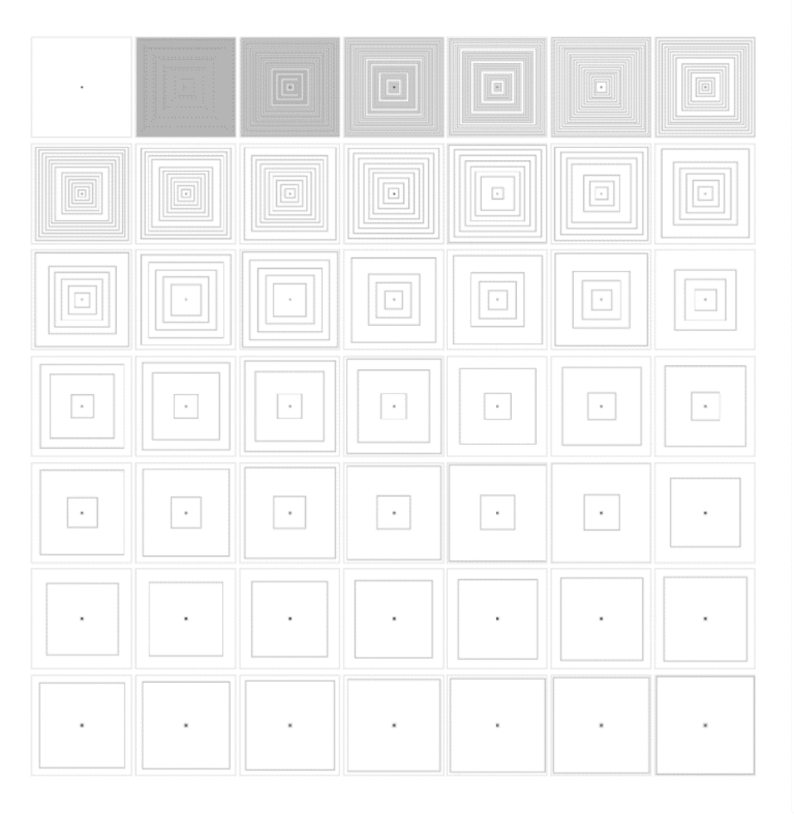

# HS23 Play 1: Creative Coding

Repository für den Creative Coding Kurs im Modul Play 1 mit Gordan Savičić & Max Frischknecht, 6.-8. November 2023, HSLU Data Design + Art

Im Kurs Creative Coding schreibt ihr eure ersten kleinen Programme um einen visuellen Output zu generieren. Ihr nutzt dazu P5js, Javascript-Library für Creative Coding, mit dem Schwerpunkt, das Programmieren für Künstler, Designer, Pädagogen, Anfänger und alle anderen zugänglich zu machen. Für mehr Info's zu P5js, schau dir die [Webseite](https://p5js.org/) an.

## Day 1

### Kickoff

  - Um gleich loslegen zu können nutzen wir den von P5 zur Verfügung gestellten Online-Editor. Erstelle dazu [hier](https://editor.p5js.org/) einen Account.
  - Schreibe deine erste Zeile Code: Ergänze ```line(0,0,100,100);``` in Zeile 7 vor dem ```}```
  - Was beschreiben die vier Parameter von `line` innherhalb der Klammern? Seht euch dazu auch die [Online-Referenz](https://p5js.org/reference/#/p5/line) an. Eine solche Referenz existiert für jede Funktion die P5 bietet.
  - Kannst du den Code ergänzen, damit ein X angezeigt wird?
  - Könnt ihr einen Kreis in die Mitte der Zeichenfläche setzen? Färbt den Kreis in einer anderen Farbe ein.


### Übung 1: Selbstporträt


Zeichnet euch selbst in P5js! Don’t go for realistic, konzentriert euch auf ein markantes Detail. Alles ist erlaubt. Dadurch lernt ihr die folgenden grundlegenden Techniken von P5: 

- Umgang mit dem Koordinaten System
- (ev hier oder schon oben?: Grundstruktur eines Programmes mit `setup` und `draw`)
- Zeichnen mit Formen (`rect`, `ellipse`, u.a.)
- Umgang mit Farben und Konturen (`fill`, `stroke`, `strokeWeight`, `noFill`, `noStroke`)
- Verwenden von Variablen für Zahlen- und Farbwerte (`let x = 10;`)
- Verwenden von Kommentaren mit `// mein Kommentar`

Geht alles etwas schnell? Wir können euch die Youtube-Tutorials von Dan Shiffmann ans Herz legen. [Hier gibts eines zu Formen, Farben und Zeichnen in P5.](https://www.youtube.com/watch?v=c3TeLi6Ns1E&list=PLRqwX-V7Uu6Zy51Q-x9tMWIv9cueOFTFA&t=0s))

### Übung 2: 10Print


10 Print ist ein [bekanntes Buch](https://10print.org/) in der Creative Coding Community welches die Möglichkeiten einer einzelnen Zeile Code aus künstlerischer Perspektive diskutiert. Eure Aufgabe ist es nun eine neue Version des Klassikers “10 PRINT” zu coden. Ihr braucht dazu `line()`, Variablen, `random()` sowie die für die Programmierung sehr wichtigen **if/else Statements**.

#### Variablen

Variablen sind ein zentraler Bestandteil jeder Programmiersprache. Mittels einer Variable kann man den Wert einmal festlegen, aber an verschiedenen Orten im Programm verwenden. Hier ein Beispiel wie man eine Variable definiert.

```
let meineVariable; // definiere eine "leere" Variable
meineVariable = 10 // den Wert 10 der Variable zuweisen

let neueVariable = 20 // Variable definieren und direkt einen Wert zuweisen
```

Hier ist ein einfaches Beispiel wie eine Variable verwendet werden kann. 

```
let size = 100;
let x = 10;
let y = 10;

rect(x, y size, size) // Zeichnet ein Rechteck an Position 10, 10 mit einer Breite und Höhe von 100px
```

##### Opertoren

Handelt es sich bei der gespeicherten Variable um eine Zahl kann man einfache mathematische Operationen vornehmen mit `+`, `-`, `*` und `/`. Hier ist ein Beispiel: 

```
let size = 100 // initialer Wert
size = size + 100 // nun ist size 200
size = size - 50 // nun ist size 150
size = size * 2 // nun ist size 300
size = size / 2 // nun ist size wieder 150
```

##### Vorgegebene Variablen

Es gibt einige Variablen welche P5 euch automatisch zur Verfügung stellt:

- `mouseX` und `mouseY` beinhalten die Position eurer Maus. Versuche einmal eine Form zu zeichnen und ersetze x und y durch diese Variablen, cool oder?
- `width` und `height` beinhalten die Dimensionen eures Sketches, also die Zahlen welche ihr im Befehl `createCanvas()` festlegt. Diese Variablen sind sehr nützlich um bspw. mit einem Grid zu arbeiten oder Objekte bspw. in der Mitte zu positionieren. 
- Für weitere Info's zu Variablen sieh dir [dieses Dokument]((https://github.com/fleshgordo/LaboCreativeCoding/blob/main/02_variables.md)) sowie [dieses Video](https://tube.switch.ch/videos/8c793d97) von Gordan an.

#### Random

Normalerweise braucht man ein bisschen Zufall, damit die Resultate eurer Programme überraschend werden 🔥. Dafür gibt es u.a. den Befehl `random()` welcher euch eine zufällige Zahl innerhalb eines von euch festgelegten Rahmens erzeugt. 

```
let xRan = random(0, 100) // zufällige Zahl zwischen 1 und 100
let yRan = random(0, height) // zufällige Zahl zwischen 1 und der Höhe eures Sketches
```

#### If/Else Statements

If/Else Statements kommen in den meisten Programmiersprachen vor und sind ein zentrales Konzept. Im Kern geht es darum einen Teil des Codes nur auszuführen wenn eine Bedingung erfüllt ist, und, je nach dem ob Gewünscht, wenn die Bedingung nicht erfüllt ist, anderen Code ausführen.


```
let maximum = 100;

if(maximum == 100) {
  // wenn maximum 100 ist, wird dieser code ausgefüht
  ellipse(10, 10, 20, 20)
} else {
  // falls nicht, dieser hier
  rect(10, 10, 20, 20)
}
```

## Day 2

### Übung 3: Generatives Muster

  - Aufgabe: Aufbauend auf den Funktionen der Schlaufen probiert ein generatives Muster zu erstellen. Export dieses mittels der Funktion save()
  - Input: [Loops](https://www.youtube.com/watch?v=cnRD9o6odjk)

### Übung 4: Datensatz Array

  - Aufgabe: Erstellt zwei Arrays/Listen (mit Nummern oder Text) und visualisiert diese. Probiert andere Visualisierungsformen aus (ellipse, line, point, arc, etc.) bzw. Gegenüberstellungen wie hier im Bild (Schweiz in Bild und Zahl)
  - Input [Arrays Teil 1](https://tube.switch.ch/videos/52a76917), [Arrays Teil 2](https://tube.switch.ch/videos/f3d6bdb1), [Arrays Teil 3](https://tube.switch.ch/videos/dfebe960)
  - [Code](XXX)

### Übung 5: Datensatz CSV

  - Aufgabe: Ausgehend vom Beispiel “Daten CSV” versucht einen der beiden Parameter (oder beide, km/ feeling) zu visualisieren. Ihr könnt den Datensatz erweitern, verändern oder auf euren eigenen Datensatz anpassen. Exportiert euren Sketch als SVG oder PNG.
  - [Starter-Code](https://editor.p5js.org/ritzdank/sketches/wd1YuitBP)
  - Andere Beispiele: [Average Temperature CH](https://editor.p5js.org/ritzdank/sketches/gshTXPNA9), [Export als SVG](https://editor.p5js.org/ritzdank/sketches/Qs7CHQnJV)
  
## Day 3

  - Individuelle Projektbetreuung

## Final project Deliverable

Eine Visualisierung mit p5js und einem Datensatz welchen ihr im “Analogen Algorithmen” Teil mit Alain ausgearbeitet habt.
- p5js Code + Screenshots (Final + Prozess)
- Falls animiert - Screencast (30sec. mp4, 1080p)

## References

- [Creative Coding Intro](https://github.com/fleshgordo/LaboCreativeCoding) by Gordan 
- [Creative Coding class](https://creative-coding.decontextualize.com/) by A. Parish 
- [p5 learn](https://p5js.org/learn/)
- [p5 reference](https://p5js.org/reference/)
- [Coding Train 🚂](https://www.youtube.com/channel/UCvjgXvBlbQiydffZU7m1_aw)